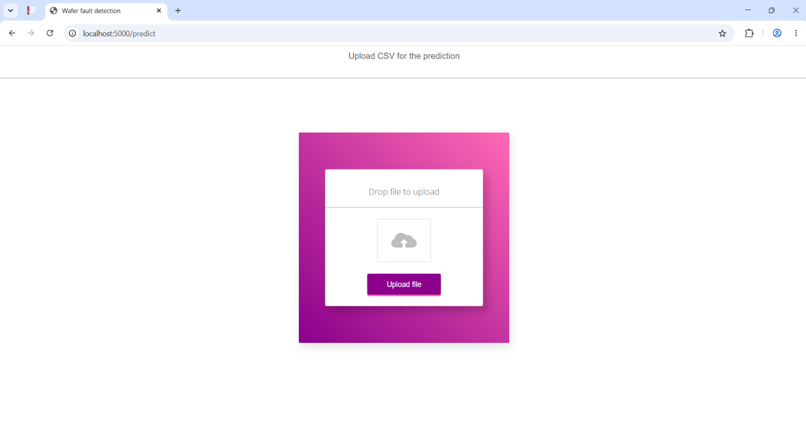
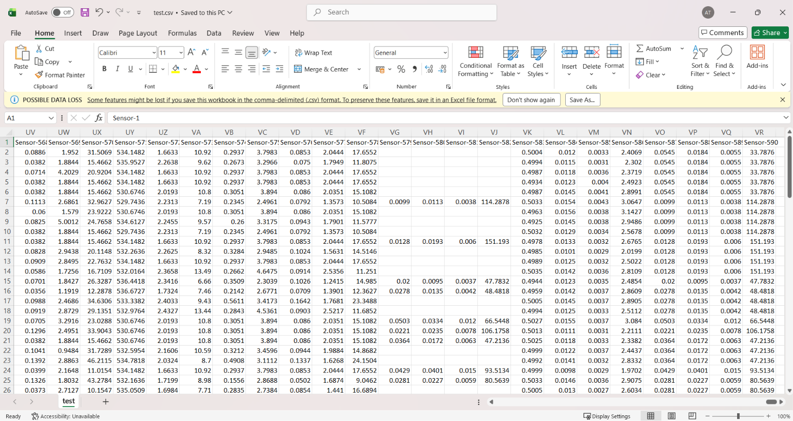
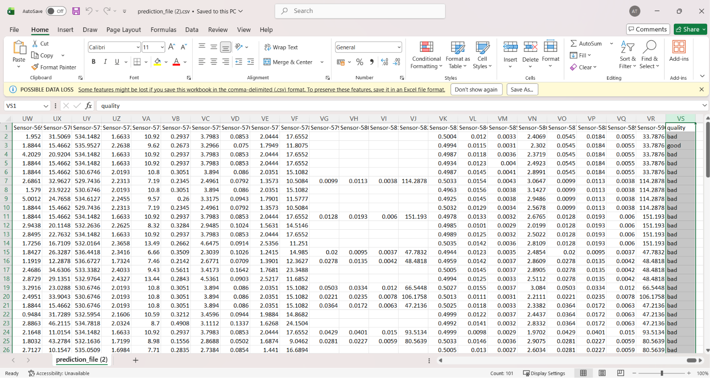

# Wafer Fault Detection System

A machine learning application that predicts wafer quality using sensor data through an end-to-end training and prediction pipeline. The system allows users to upload wafer sensor data in CSV format and generate fault predictions through a Flask-based web application.

---

## Overview

The project automates the process of wafer fault detection using machine learning techniques. It processes sensor measurements, applies a trained prediction model, and generates downloadable prediction reports. The application simplifies quality assessment by identifying whether a wafer is classified as **Good** or **Bad** based on sensor readings.

---

## Application Preview

### Upload Interface



Upload wafer sensor data in CSV format through the Flask web application.

---

### Input Sensor Dataset



Sample wafer sensor measurements provided as input to the prediction system.

---

### Generated Prediction Report



The trained machine learning model generates wafer quality predictions and exports the results as a downloadable CSV report.

---

## Features

- End-to-End Machine Learning Pipeline
- Wafer Fault Prediction System
- CSV-Based Batch Prediction
- Flask Web Application
- Automated Data Preprocessing
- Model Training and Evaluation
- Downloadable Prediction Reports
- Modular Project Architecture

---

## Project Workflow

1. Collect wafer sensor data.
2. Upload the CSV file through the web interface.
3. Apply data preprocessing and feature transformation.
4. Load the trained machine learning model.
5. Generate wafer quality predictions.
6. Download the prediction report in CSV format.

---

## Tech Stack

### Programming Language
- Python

### Machine Learning
- Scikit-Learn
- Pandas
- NumPy

### Backend
- Flask

### Data Processing
- Pandas
- NumPy

### Model Management
- Pickle

### Frontend
- HTML
- CSS

---

## Project Structure

```text
sensorproject01/
│
├── app.py
├── upload_data.py
├── requirements.txt
├── setup.py
│
├── artifacts/
├── prediction_artifacts/
├── predictions/
│
├── src/
│   ├── components/
│   ├── pipeline/
│   ├── utils/
│   ├── logger.py
│   └── exception.py
│
├── templates/
├── static/
├── screenshots/
└── README.md
```

---

## How to Run

### Clone the Repository

```bash
git clone https://github.com/your-username/wafer-fault-detection.git
cd wafer-fault-detection
```

### Install Dependencies

```bash
pip install -r requirements.txt
```

### Run the Application

```bash
python app.py
```

Open your browser and visit:

```text
http://localhost:5000/predict
```

---

## Learning Outcomes

- End-to-End Machine Learning Pipeline Development
- Data Ingestion and Data Transformation
- Model Training and Evaluation
- Flask Web Application Development
- Batch Prediction Systems
- Model Serialization using Pickle
- Production-Oriented Project Structure
- Exception Handling and Logging

---

## Output

The application generates a prediction report containing wafer quality classifications based on sensor readings.

Example:

| Prediction |
|------------|
| Good |
| Bad |
| Good |
| Bad |

---

## License

This project is intended for educational and learning purposes.